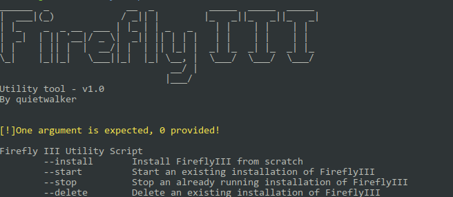
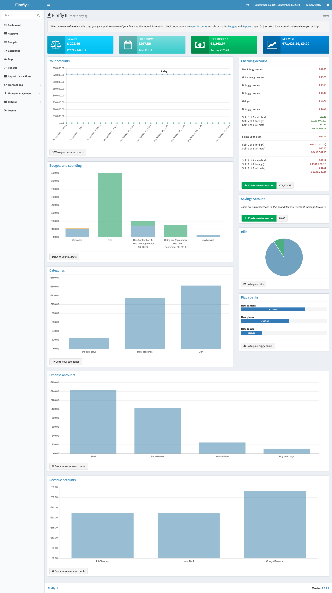

# firefly3-compose-script
This is a script which will install and manage a docker compose deployed FireFly3 system

# What is FireFlyIII
Firefly is a free and open source personal finance manager. 
It offer a lot of feature such as: 
- **Full transaction management**: You can quickly enter and organize your transactions in multiple currencies. 
- **Budget, categories and tags**: Need to budget your expenses? Want to categorize all of your hobby expenses? Look no further. Firefly III supports all kinds
- **Rule Engine**: Use the rule engine to automatically set budgets, remove categories, append descriptions, change notes or something else entirely. 
- **Import transactions**: Firefly III can import from variety of sources using the wonderful Salt Edge API, that allows access to over 2500 financial institutions and counting and it is also capable to import from CSV files
- **Reports**: Firefly III has advanced reporting capabilities, showing your expenses per week, month or year. 
- **JSON REST API**: if you don't know what this mean, then you don't need this feature :P 

# Dependeces 
It ony require 2 packages to be executed: 
- *docker* 
- *docker-compose* 

# How to use
The script, if launched without arguments, it will display a little helper reporting the possible arguments that can be used.
The argument could be: 

```
    --install    Install FireflyIII from scratch
    --start      Start an existing installation of FireflyIII
    --stop       Stop an already running installation of FireflyIII
    --delete     Delete an existing installation of FireflyIII
```

So if you are using this script for the first time it should be enough to execute it as follow: 


```
    chmod +x firefly-utility-tool.sh
    ./firefly-utility-tool.sh --install
```

# Add CSV Importer
Firefly, unfortunatetly doesn't offer an already embedded CSV importer and this mean that if you want to uplad a bank/software produced CSV file in FireFly III you have to use an external CSV container. But don't worry: I've tried to keep it simple. 
From my understanding, there isn't a way to automate the deploy of the CSV importer container using docker compose, so after you install FireFly III with the script *firefly-utility-tool.sh*, you have to follow 2 simple steps to run the CSV importer container! So hereafter the steps are described. 

## Step 1: Create a Personal Access Token 
From the Firefly Web page, go to your profile page (visit /profile) and follow these instructions:

- Click on "create new token" 
- Set a name for the token (for example: *CSV-importer-token*)
- Copy the entire token. Yes, it's very long!
- Go to the Step 2! 

## Step 2: Add you Token to the run-firefly-csv-importer.sh
Once you have you Personal Access Token: 
- open the file *run-firefly-csv-importer.sh* with a text editor 
- paste your previously generated token in the variable PERSONAL_ACCESS_TOKEN as follow:
```
    PERSONAL_ACCESS_TOKEN=eyJKabcdefghi....
``` 
- save and close the file 
- execute the following commands:
```
    chmod +x run-firefly-csv-importer.sh
    ./run-firefly-csv-importer.sh
```
- Now, visiting the address http://localhost:8081/ you should be able to upload your csv files

# Screenshot



